# QA Scanner Tool

## Overview

## Architecture

## Development Process (Cursor Workflow)

### Screenshot 1 — Requirement Analysis & Planning
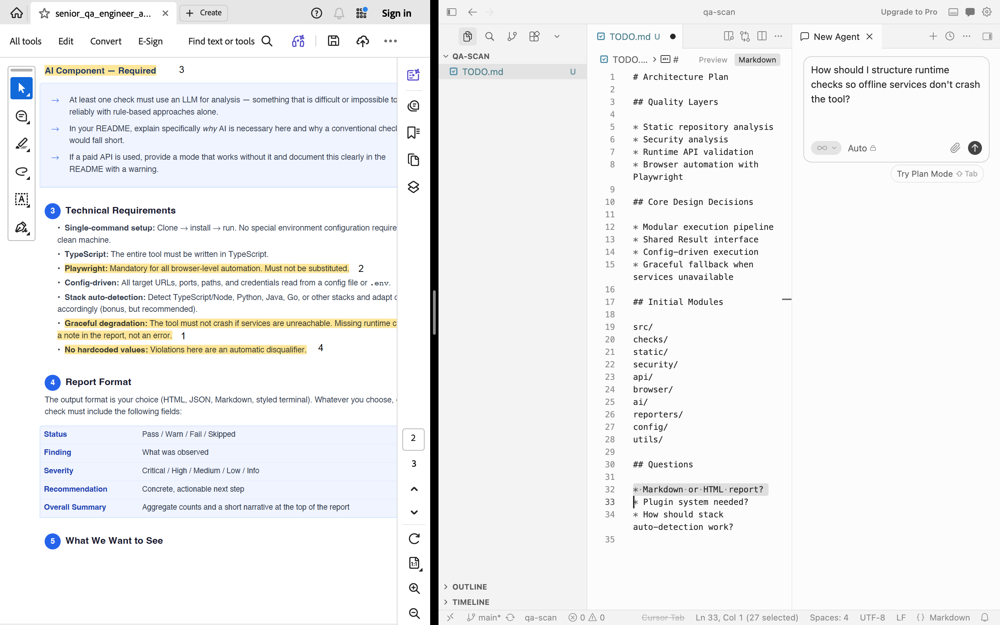

Before commit:
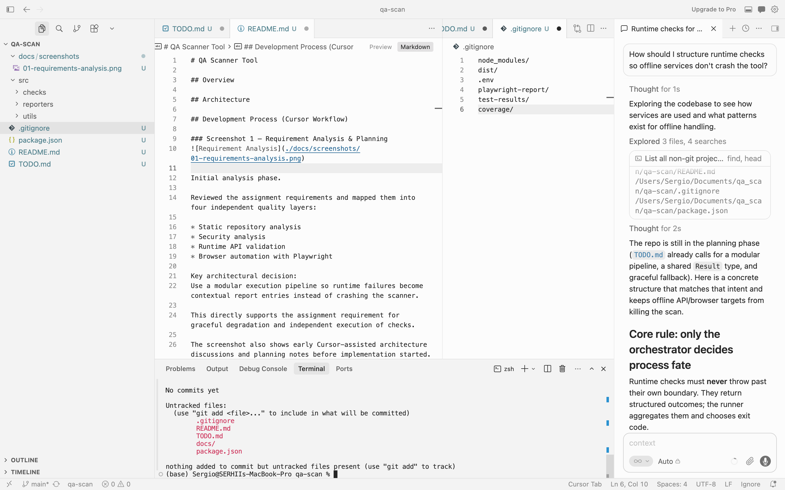

Initial analysis phase.

Reviewed the assignment requirements and mapped them into four independent quality layers:

* Static repository analysis
* Security analysis
* Runtime API validation
* Browser automation with Playwright

Key architectural decision:
Use a modular execution pipeline so runtime failures become contextual report entries instead of crashing the scanner.

This directly supports the assignment requirement for graceful degradation and independent execution of checks.

The screenshot also shows early Cursor-assisted architecture discussions and planning notes before implementation started.


### Screenshot 2 — Architecture Planning

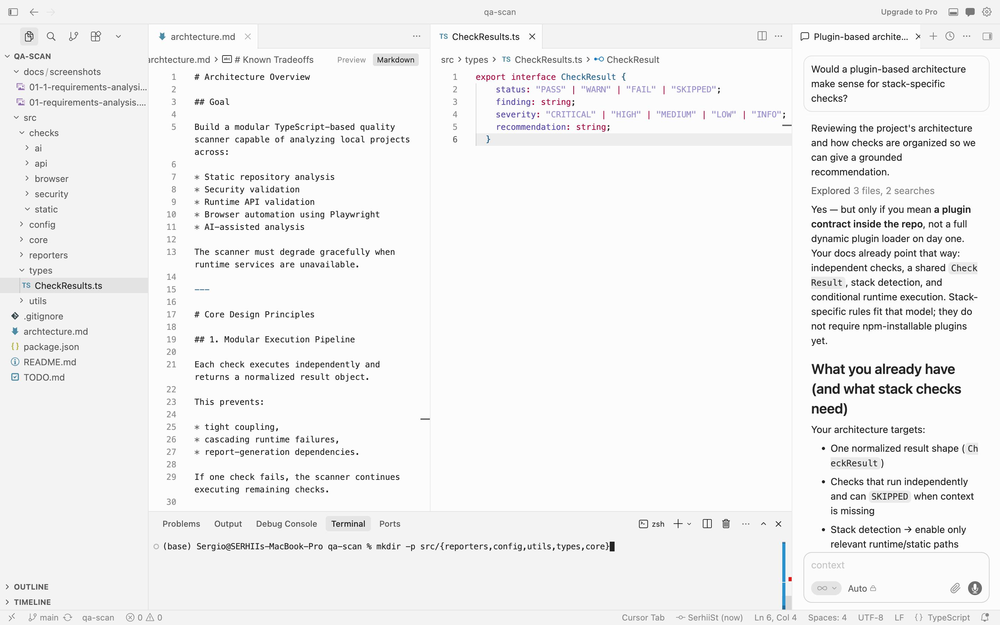


Early architecture planning phase before implementation began.

At this stage, the project structure and execution model were designed around the assignment’s core constraints:

* graceful degradation,
* config-driven execution,
* modular quality checks,
* runtime-independent operation.

The scanner was intentionally separated into independent modules:

* static analysis,
* security analysis,
* API/runtime checks,
* browser automation,
* AI-assisted analysis.

A normalized `CheckResult` interface was introduced early to ensure all checks could produce consistent, report-friendly output regardless of implementation details.

The Cursor discussion focused on:

* pipeline orchestration,
* handling unavailable runtime services,
* avoiding cascading failures,
* future extensibility for stack-specific checks.

This planning stage strongly influenced the final modular execution architecture.

### Screenshot 3 — Initial Project Bootstrap
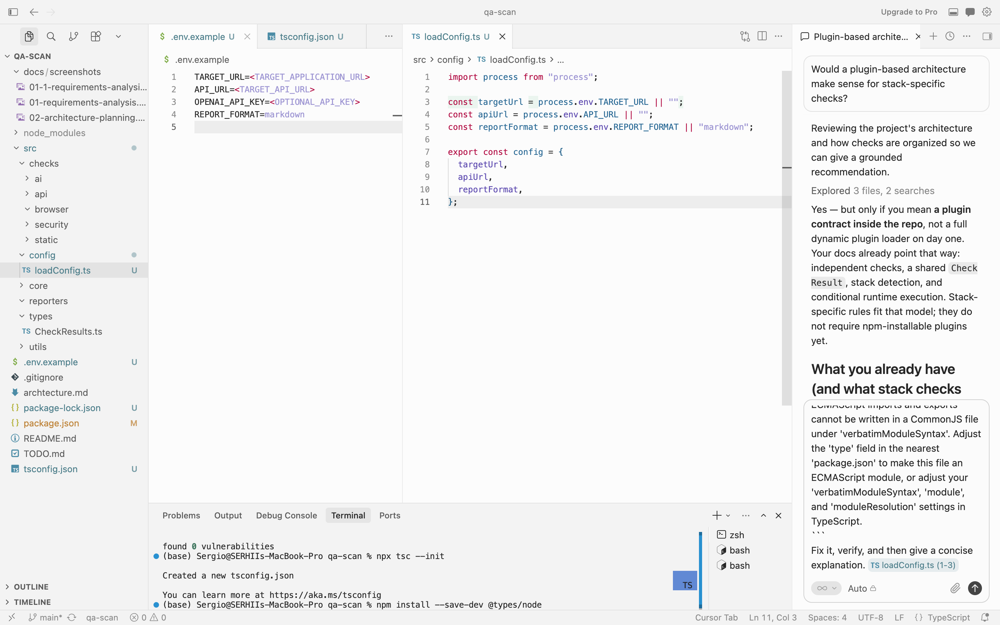

All runtime targets, credentials, ports, and paths are loaded dynamically through environment configuration.

The implementation intentionally avoids hardcoded infrastructure assumptions to support execution against arbitrary local projects and stacks.

### Screenshot 4 — Runtime Failure & Graceful Degradation

Initial implementation crashed because runtime configuration was missing.
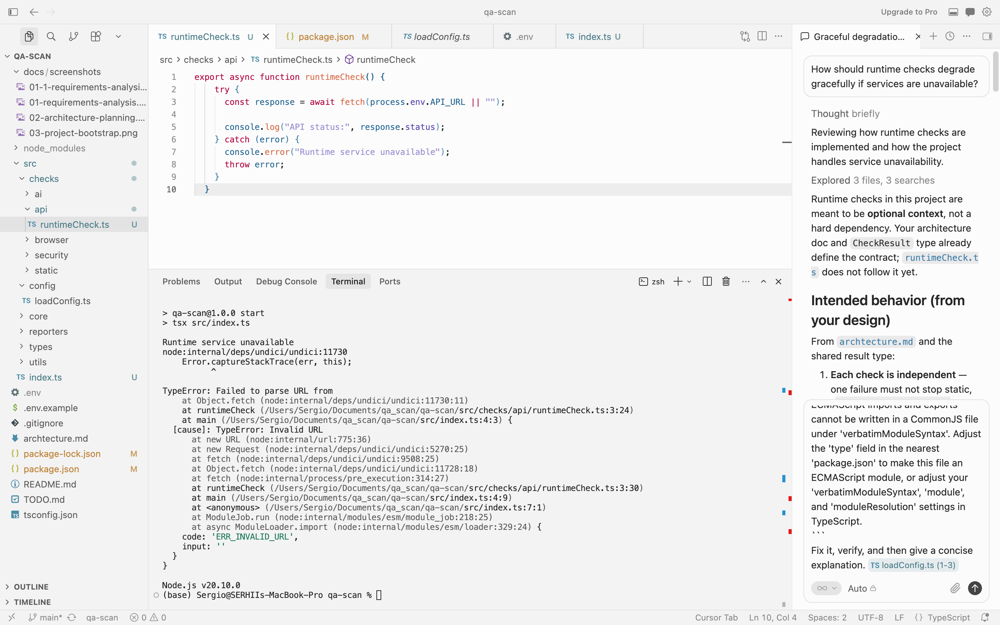

Refactored runtime checks to:
- validate configuration early,
- avoid invalid fetch calls,
- return normalized SKIPPED results,
- continue execution gracefully.

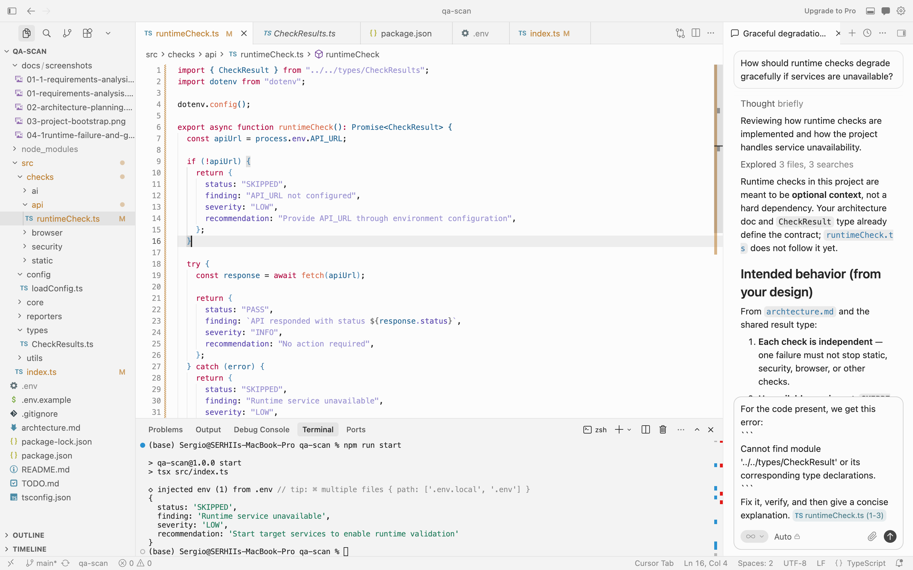

### Screenshot 5 — AI Assisted Architecture Refactor
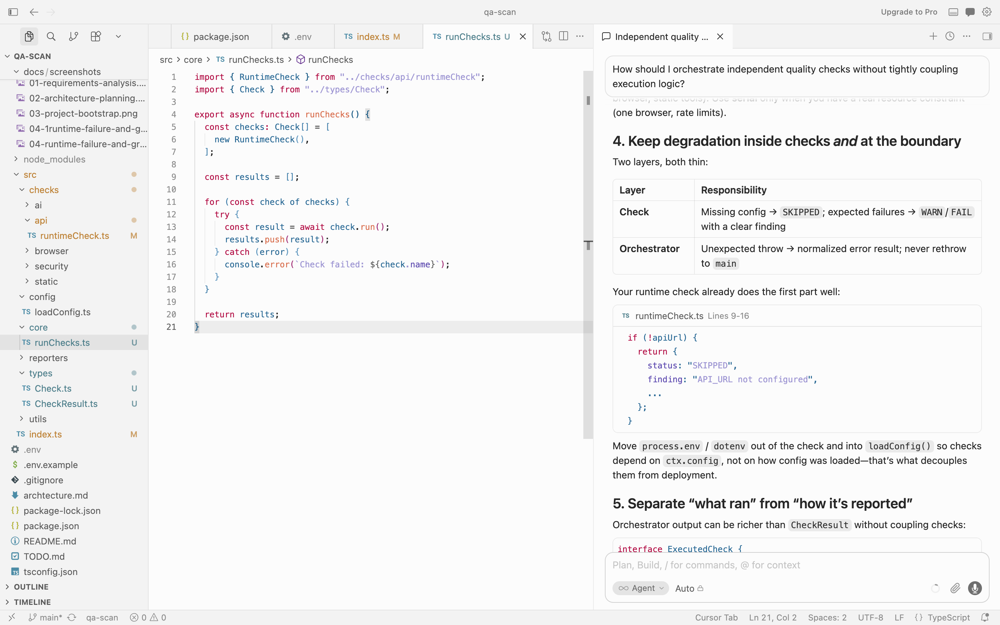

We can use prompt like:
- How should I orchestrate independent quality checks without tightly coupling execution logic?
- Would a plugin-based architecture make sense for stack-specific checks?
- How can I prevent one failed check from crashing the entire pipeline?

As the number of quality checks increased, the initial execution pipeline became too tightly coupled and difficult to scale cleanly.

Cursor was used to explore architectural alternatives for:

independent check execution,
plugin-style extensibility,
isolated failure handling,
and stack-specific adaptation.

The final design introduced:

shared check interfaces,
execution isolation,
normalized results,
and modular orchestration.

The screenshot captures the transition from an early hardcoded execution model toward a more extensible pipeline-oriented architecture.


### Screenshot 6 — Manual Refactor

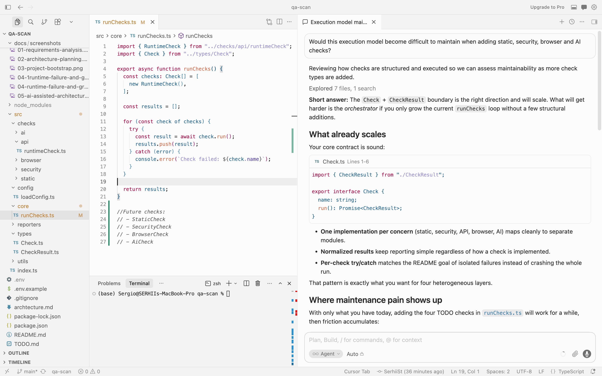


After the first working implementation, the execution pipeline was manually refactored to improve maintainability and extensibility. I refactored early.

The original approach directly invoked individual checks, which would become increasingly difficult to manage as additional modules were introduced.

The refactor introduced:

a shared Check interface,
a centralized check registry,
execution isolation,
and a scalable iteration model.

We can add new checks like:
```
const checks: Check[] = [
  new RuntimeCheck(),
  new StaticCheck(),
  new SecurityCheck(),
  new BrowserCheck(),
  new AiCheck()
];
```

This design allows new checks to be added with minimal changes to orchestration logic while supporting graceful failure handling.


### Screenshot 7 — Playwright Browser Checks

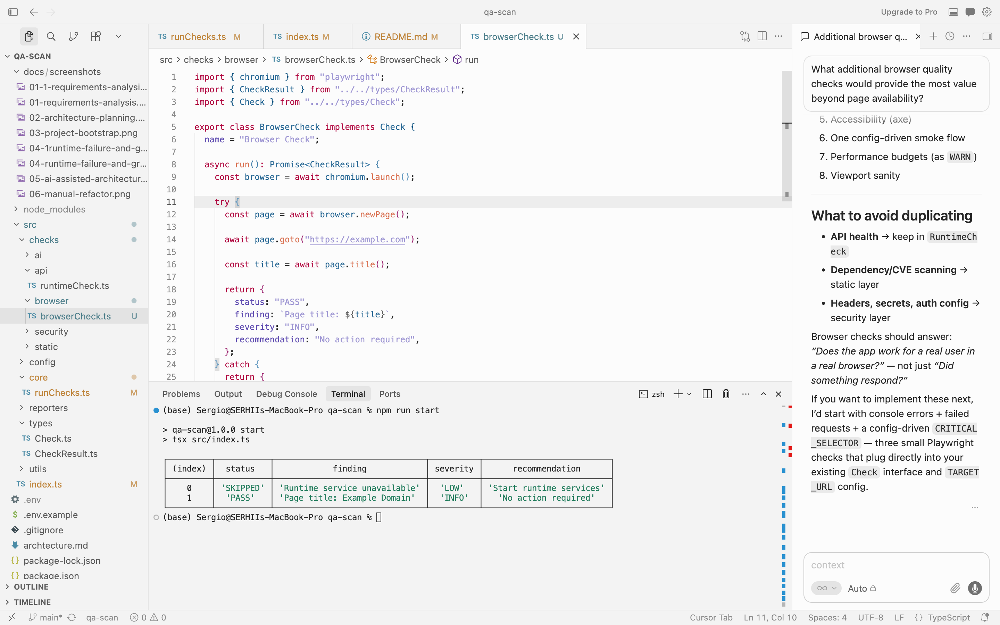


Browser automation was introduced using Playwright to validate frontend behavior beyond static repository analysis.

The initial browser check focused on:

* launching a browser instance,
* navigating to the configured target,
* validating page availability,
* and collecting basic browser-level signals.

The architecture was designed so browser validation remains independent from API and static analysis checks, allowing execution to continue even when frontend services are unavailable.


### Screenshot 8 — AI Feature Integration

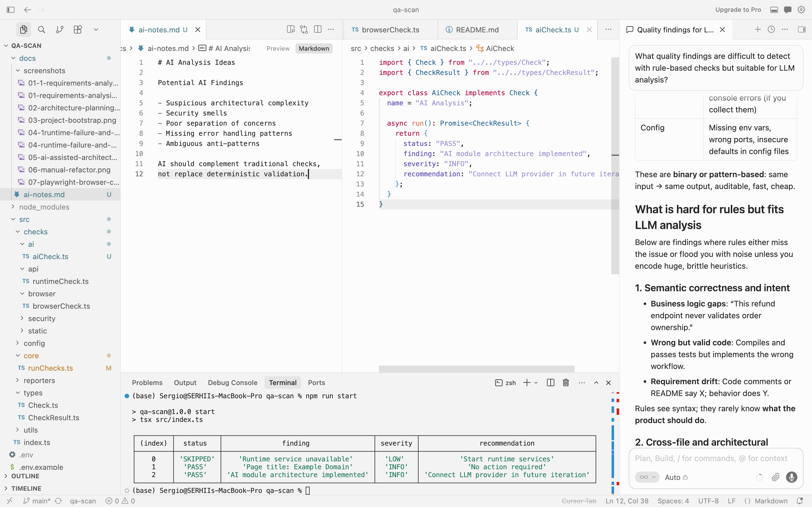


An AI-assisted analysis layer was introduced to complement deterministic quality checks.

The goal of this module is not to replace static analysis or runtime validation, but to identify patterns that are difficult to capture through predefined rules alone.

Potential use cases include:

* architectural complexity assessment,
* security smell detection,
* error-handling gaps,
* and maintainability concerns.

The screenshot captures the exploration of AI-specific quality signals and the introduction of a dedicated AI analysis module within the scanning pipeline.

### Screenshot 9 — Sample Report Generation

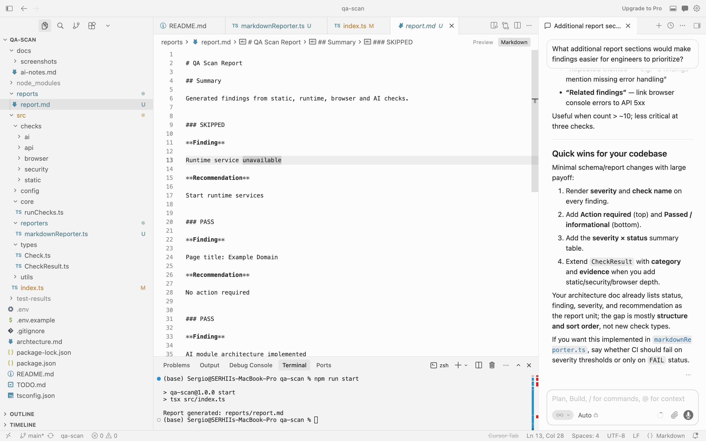

The final stage of development focused on consolidating findings into a human-readable report.

A dedicated reporting layer was introduced to transform normalized check results into actionable output containing:

* findings,
* recommendations,
* execution outcomes,
* and supporting context.

The report generation process remains independent from individual quality checks, allowing additional output formats to be added in future iterations without modifying analysis logic.

This screenshot captures the first end-to-end execution producing a consolidated quality report.

